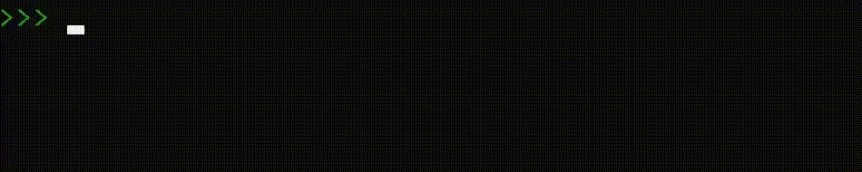

<!--
**GabrielNetSec/GabrielNetSec** is a ✨ _special_ ✨ repository because its `README.md` (this file) appears on your GitHub profile.

Here are some ideas to get you started:

- 🔭 I’m currently working on ...
- 🌱 I’m currently learning ...
- 👯 I’m looking to collaborate on ...
- 🤔 I’m looking for help with ...
- 💬 Ask me about ...
- 📫 How to reach me: ...
- 😄 Pronouns: ...
- ⚡ Fun fact: ...
-->
# Hello, My name is Gabriel 👋 Welcome to my ePortfolio!

I am an IT Engineer with experience in Telecommunications, IP Networking, Cybersecurity, and DevOps. Skilled in planning, implementing, and managing large-scale networks, including Mobile Data Networks, ISP infrastructure, and Cloud systems. 

Proficient in network automation (DevNet) with Python, and experience in Coding and Project Management.

Recognized for problem-solving, adaptability, and leadership, I thrive under pressure, delivering high-quality results.  

Currently pursuing a Master of Engineering in Telecommunications and Information Security (MTIS) at the University of Victoria (UVic) - Canada.

## Objective

My journey in IT has led me to develop a passion for Cybersecurity, and I am now eager to transition into this field, specifically aiming to join a Security Operations Center (SOC) as a DevSecOps Analyst or a Red Team as a Pentesting Engineer.

## Skills

<!--
| Skill                                         | Associated Project         |
|-----------------------------------------------|----------------------------|
| SIEM Implementation and Log Analysis          | <a href="https://google.com">Detection Lab</a>|
| Network Traffic Monitoring and Attack Detection | <a href="https://google.com">Detection Lab</a>|
| Security Automation with Shuffle SOAR         | SOC Automation Lab|
| Incident Response Planning and Execution      | SOC Automation Lab|
| Case Management with TheHive                  | SOC Automation Lab|
| Scripting and Automation for Threat Mitigation | SOC Automation Lab|
-->

| Skill                                         | Associated Project (At UVic)        |
|-----------------------------------------------|----------------------------|
| IoT Technology Implementation                 | <a href="https://github.com/GabrielNetSec/IoT-Projects">IoT Analitycs and Security Project (EC569A) at UVic</a>|
| Analysis & Design of Communication Networks   | <a href="https://github.com/GabrielNetSec/MTIS-Project-Courses-at-UVic">Roommate Wi-Fi Sharing (EC514) at UVic</a>|
| Network Defence - Firewalls and IPSs          | <a href="https://github.com/GabrielNetSec/MTIS-Project-Courses-at-UVic">Cisco ASA & PA IPS Configuration Projects (EC519C) at UVic</a>|
| Scripting and Automation with Python          | <a href="https://github.com/GabrielNetSec/Python-Network-Programmability">Python-Network-Programmability</a>|

## Tools

### Network

    
    
    
    
    

<!--
### Endpoint

    
    

-->

### Cloud

    
    

### Coding

    
    
    

### Firewalls/IPS

   
  
  

### SIEM

   
   

## Certifications

  
   
  
   

## Projects
- <a href="https://github.com/GabrielNetSec/IoT-Projects">IoT Analitycs and Security Project (EC569A) at UVic</a>
- <a href="https://github.com/GabrielNetSec/MTIS-Project-Courses-at-UVic">Roommate Wi - Fi Sharing (EC514) at UVic</a>
- <a href="https://github.com/GabrielNetSec/MTIS-Project-Courses-at-UVic">Cisco ASA FW & PA IPS Configuration Projects (EC519C) at UVic</a>
- <a href="https://github.com/GabrielNetSec/Python-Network-Programmability">Python-Network-Programmability</a>
